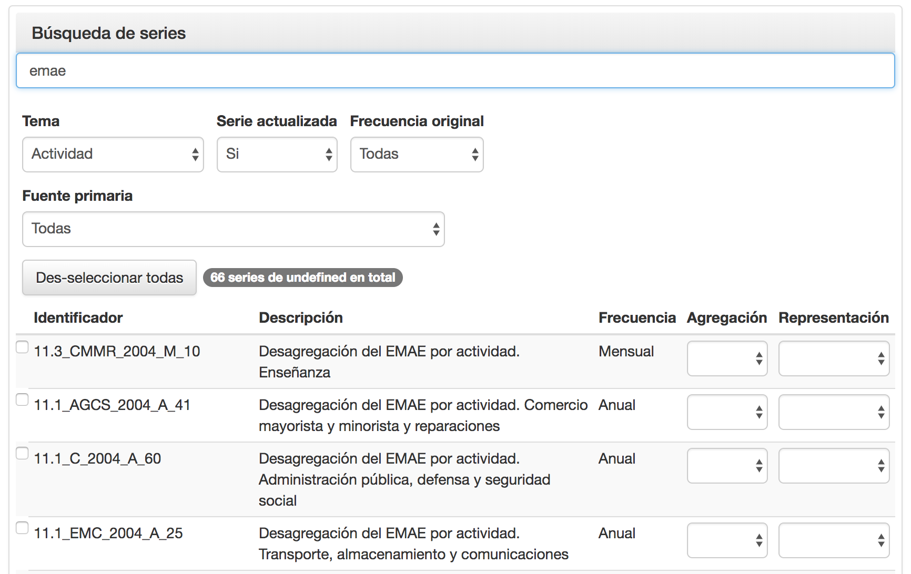

# Comenzar a usar la API de Series de Tiempo

<!-- START doctoc generated TOC please keep comment here to allow auto update -->
<!-- DON'T EDIT THIS SECTION, INSTEAD RE-RUN doctoc TO UPDATE -->
 

- [1. Buscar series](#1-buscar-series)
    - [En un archivo](#en-un-archivo)
    - [En aplicaciones web](#en-aplicaciones-web)
- [2. Armar consulta](#2-armar-consulta)
    - [Manualmente](#manualmente)
    - [Generador de consultas](#generador-de-consultas)
- [3. Realizar consulta](#3-realizar-consulta)
    - [Consultar o integrar JSON](#consultar-o-integrar-json)
    - [Descargar CSV](#descargar-csv)
    - [Integrar en planilla de cálculo](#integrar-en-planilla-de-calculo)

<!-- END doctoc generated TOC please keep comment here to allow auto update -->

## 1. Buscar series

Para usar la API, debes buscar los _ids_ de las series que te interesan.

### En un archivo

En [datos.gob.ar](http://datos.gob.ar) podés encontrar la [base completa de series de tiempo](http://datos.gob.ar/dataset/modernizacion-base-series-tiempo-administracion-publica-nacional), que contiene la lista de series disponibles en:

+ [CSV](http://infra.datos.gob.ar/catalog/modernizacion/dataset/1/distribution/1.2/download/series-tiempo-metadatos.csv)
+ [XLSX](http://infra.datos.gob.ar/catalog/modernizacion/dataset/1/distribution/1.6/download/series-tiempo-metadatos.xlsx)
+ [DTA](http://infra.datos.gob.ar/catalog/modernizacion/dataset/1/distribution/1.10/download/series-tiempo-metadatos.dta)

  

### En aplicaciones web

* [Generador de consultas](https://datosgobar.github.io/series-tiempo-ar-call-generator)

## 2. Armar consulta

### Manualmente

Los ids de las series deben pasarse al parámetro `ids`. Se pueden usar parámetros adicionales para [filtrar y transformar las series](additional_parameters.md).

Ver la [referencia API](reference/api_reference.md) para consultar la documentación completa de todos los parámetros disponibles.

### Generador de consultas

[Generador de consultas](https://datosgobar.github.io/series-tiempo-ar-call-generator)

## 3. Realizar consulta

### Consultar o integrar JSON

Para realizar la consulta directamente en el navegador, o integrarla en una aplicación:

* Usar `format=json` (valor default).
* Elegir el nivel de detalle de los metadatos `metadata=none`, `only`, `simple` o `full`.

[`http://apis.datos.gob.ar/series/api/series?ids=168.1_T_CAMBIOR_D_0_0_26,103.1_I2N_2016_M_15&format=json&metadata=full`](http://apis.datos.gob.ar/series/api/series?ids=168.1_T_CAMBIOR_D_0_0_26,103.1_I2N_2016_M_15&format=json&metadata=full)

### Descargar CSV

Para descargar un archivo CSV:

* Usar `format=csv`.

[`http://apis.datos.gob.ar/series/api/series?ids=168.1_T_CAMBIOR_D_0_0_26,103.1_I2N_2016_M_15&format=csv`](http://apis.datos.gob.ar/series/api/series?ids=168.1_T_CAMBIOR_D_0_0_26,103.1_I2N_2016_M_15)

### Integrar en planilla de cálculo

Tanto la consulta en CSV como en JSON se pueden [integrar en planillas de cálculo](spreadsheet_integration.md).
